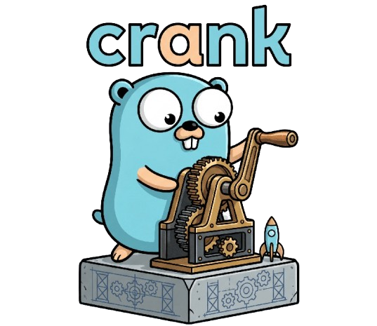

<div align="center">



<p>
  <a href="https://github.com/anurag925/crank/actions/workflows/ci.yml"></a>
  <a href="https://github.com/anurag925/crank/releases/latest"></a>
  <a href="https://goreportcard.com/report/github.com/anurag925/crank"></a>
  
  <a href="LICENSE"></a>
</p>

<p><b>Scaffold production-ready Go backend services — and run your entire dev workflow — without leaving your terminal.</b></p>

</div>

---

**crank** is a modular CLI that scaffolds clean, layered Go services from a curated set of
optional modules, then wraps the everyday tools (`go`, `migrate`, `swag`, `air`, …) as first-class
subcommands. Pick your features, get a sensible, idiomatic project, and never leave the CLI.

## Quick start

```bash
# 1. Install
curl -fsSL https://raw.githubusercontent.com/anurag925/crank/main/install.sh | sh

# 2. Scaffold a service (required tools are checked & installed automatically)
crank init myapp --features=base,auth,postgres

# 3. Run it
cd myapp && crank run
```

## Features

| Feature   | Description |
| --------- | ----------- |
| `base`    | Echo v4 HTTP server, Viper configuration, structured `slog` logging, health probe, graceful shutdown, Makefile, Dockerfile, Air live-reload config |
| `auth`    | JWT issuance + validation, refresh tokens, bcrypt password hashing, Echo middleware for protected routes |
| `crypto`  | AES-256-GCM encryption/decryption helpers, config-driven secret, base64-url output |
| `postgres`| PostgreSQL via Bun ORM, golang-migrate migrations, repository pattern with `GetByEmail` lookup |
| `redis`   | Redis client (session storage / caching / rate limiting) |
| `mongodb` | MongoDB client (document storage / aggregation) |

## Installation

### Install script (recommended)

Install the latest release for your platform (Linux / macOS, amd64 / arm64):

```bash
curl -fsSL https://raw.githubusercontent.com/anurag925/crank/main/install.sh | sh
```

The script detects your OS/architecture, downloads the matching release archive,
verifies its checksum, and installs the `crank` binary to `/usr/local/bin`
(falling back to `~/.local/bin` if that isn't writable).

Environment overrides:

| Variable | Description |
| -------- | ----------- |
| `CRANK_VERSION` | Install a specific version (e.g. `v0.1.0`) instead of the latest |
| `CRANK_INSTALL_DIR` | Target install directory |
| `CRANK_NO_VERIFY` | Skip checksum verification |

```bash
# Pin a version and install into a custom directory
CRANK_VERSION=v0.1.0 CRANK_INSTALL_DIR="$HOME/bin" \
  sh -c "$(curl -fsSL https://raw.githubusercontent.com/anurag925/crank/main/install.sh)"
```

### go install

```bash
go install github.com/anurag925/crank/cmd/bootstrap@latest
```

Note: this produces a binary named `bootstrap`. Rename it to `crank` if you like:

```bash
mv "$(go env GOPATH)/bin/bootstrap" "$(go env GOPATH)/bin/crank"
```

### Prebuilt binaries

Download the archive for your platform from the
[Releases page](https://github.com/anurag925/crank/releases) (Windows `.zip`
included), extract it, and move the `crank` binary onto your `PATH`.

### Build from source

```bash
go build -o crank ./cmd/bootstrap
```

Verify your installation with:

```bash
crank --version
```

## Usage

### Project Lifecycle

```bash
# Scaffold a new project (tools are checked/installed automatically)
./crank init myapp --features=base,auth,postgres

# List available features
./crank list

# Add a feature to an existing project
./crank add redis --project=./myapp

# Generate a new migration
./crank make migration create_orders --project=./myapp
```

### Development Tools (all accept --project or use current directory)

```bash
# Run migrations
./crank migrate up --project=./myapp
cd myapp && ./crank migrate up                    # current directory

# Run the project
./crank run --project=./myapp
cd myapp && ./crank run

# Build the binary
./crank build --project=./myapp

# Run with live reload
./crank dev --project=./myapp

# Generate Swagger docs
./crank swag --project=./myapp

# Run tests
./crank test -v --project=./myapp

# Format code
./crank gofmt --project=./myapp

# Vet code
./crank vet --project=./myapp

# Tidy module dependencies
./crank tidy --project=./myapp

# List all available tool subcommands
./crank tools
```

### Auto-install

When you run `crank init`, the CLI checks that all tools required by the selected
features are installed. Missing tools are installed automatically via `go install`.
When you run a tool subcommand directly and the binary is missing, crank attempts
auto-install before giving up.

## Tool Subcommands

| Subcommand | Wraps | Binary | Requires |
|------------|-------|--------|----------|
| `crank migrate` | golang-migrate | `migrate` | `postgres` feature |
| `crank swag` | swaggo/swag | `swag` | — |
| `crank build` | `go build` | `go` | — |
| `crank run` | `go run ./cmd/server` | `go` | — |
| `crank dev` | air (live reload) | `air` | — |
| `crank test` | `go test ./...` | `go` | — |
| `crank gofmt` | `gofmt -s -w .` | `gofmt` | — |
| `crank vet` | `go vet ./...` | `go` | — |
| `crank tidy` | `go mod tidy` | `go` | — |

### Adding a New Tool Wrapper

1. Create `internal/bootstrap/tools/<name>/tool.go`
2. Implement the `bootstrap.Tool` interface
3. Self-register in `init()`: `bootstrap.GlobalToolRegistry.MustRegister(&tool{})`
4. Add a blank import in `cmd/bootstrap/main.go`

The command factory handles `--project`, binary lookup, auto-install, and execution.

## Architecture

```
crank/
├── cmd/bootstrap/main.go          # CLI entry point (cobra)
├── internal/
│   ├── bootstrap/                 # generation engine + tool wrapper system
│   │   ├── generator.go           # Generate / Add entry points
│   │   ├── feature.go             # Feature interface + registry
│   │   ├── tool.go                # Tool interface + ToolRegistry
│   │   ├── tool_registry.go       # GlobalToolRegistry singleton
│   │   ├── context.go             # template context
│   │   ├── manifest.go            # .crank.yaml I/O
│   │   ├── registry.go            # process-wide feature registry
│   │   ├── result.go
│   │   ├── commands/              # one cobra command per subcommand
│   │   │   ├── init.go            # `crank init` (includes tool checking)
│   │   │   ├── add.go             # `crank add`
│   │   │   ├── list.go            # `crank list`
│   │   │   ├── make.go            # `crank make`
│   │   │   └── tools.go           # generic tool command factory
│   │   └── tools/                 # tool wrappers (one package per CLI)
│   │       ├── install.go         # shared InstallGoTool helper
│   │       ├── migrate/           # golang-migrate wrapper
│   │       ├── swag/              # swaggo/swag wrapper
│   │       ├── build/             # go build wrapper
│   │       ├── run/               # go run wrapper
│   │       ├── dev/               # air live-reload wrapper
│   │       ├── test/              # go test wrapper
│   │       ├── gofmt/             # gofmt wrapper
│   │       ├── vet/               # go vet wrapper
│   │       └── tidy/              # go mod tidy wrapper
│   ├── utils/                     # filesystem + exec helpers
│   │   ├── fileutil.go
│   │   └── exec.go
│   └── bootstrap/features/        # one package per installable module
│       ├── base/
│       ├── auth/
│       ├── postgres/
│       ├── redis/
│       └── mongodb/
└── go.mod
```

Each feature is a Go package with:

1. An `embed.FS` containing `templates/*.tmpl`
2. A `Files() []FileMapping` describing template → output path pairs
3. A self-registration in `init()` against `bootstrap.GlobalRegistry`

Each tool is a Go package with:

1. An implementation of the `bootstrap.Tool` interface
2. A self-registration in `init()` against `bootstrap.GlobalToolRegistry`

Templates are rendered with Go's `text/template`; the supplied `Context` exposes
the project name, module path and a `Has(name string) bool` helper so templates
can include feature-specific sections with `{{if .Has "postgres"}} ... {{end}}`.

## Configuration strategy

`configs/config.yaml` ships safe defaults that are committed to source. Secrets and
environment-specific values live in `.env` (git-ignored) and are loaded by Viper
as env vars. Environment variables always win. Config files follow the
[golang-standards/project-layout](https://github.com/golang-standards/project-layout#configs) `configs/` convention.

## Phase status

| Phase | Description | Status |
| ----- | ----------- | ------ |
| 1 | Core CLI scaffold + base feature | ✅ |
| 2 | Auth feature | ✅ |
| 3 | Postgres feature | ✅ |
| 4 | Project generation + dev tooling (Makefile, Air, Dockerfile) | ✅ |
| 5 | Redis module | ✅ (placeholder) |
| 6 | MongoDB module | ✅ (placeholder) |
| 7 | Pluggable tool wrapper system | ✅ |

## Testing

crank has three test layers:

| Layer | What it covers | Run |
|-------|----------------|-----|
| **Unit** | registry, context, manifest, generator, utils | `go test ./internal/... ./cmd/...` |
| **Integration** | renders every feature/combo and asserts on generated files | `go test ./internal/...` |
| **End-to-end** | builds the real binary, exercises the CLI, and compiles generated projects | `go test -tags e2e ./e2e/...` |

A helper script wraps all of them:

```bash
./scripts/test.sh unit   # fast, network-free
./scripts/test.sh e2e    # build binary + compile generated projects
./scripts/test.sh all    # everything (default)
```

The e2e suite is gated behind the `e2e` build tag (it needs network access for
`go get`), so the default `go test ./...` stays fast and offline. CI runs the
fast suite and the e2e suite as separate jobs on every push and pull request.

## Contributing

Contributions are welcome! To get started:

1. Fork and clone the repo.
2. Make your change, keeping it idiomatic and `gofmt`-clean.
3. Add tests (extend `integration_test.go` and the e2e `compileCases` for new features).
4. Run `./scripts/test.sh all` and ensure everything passes.
5. Open a pull request.

See the [tool wrapper](#adding-a-new-tool-wrapper) extension point above, and
`AGENTS.md` for a deeper guide to adding features and tools.

## License

Released under the [MIT License](LICENSE) © 2026 Anurag Upadhyay.
