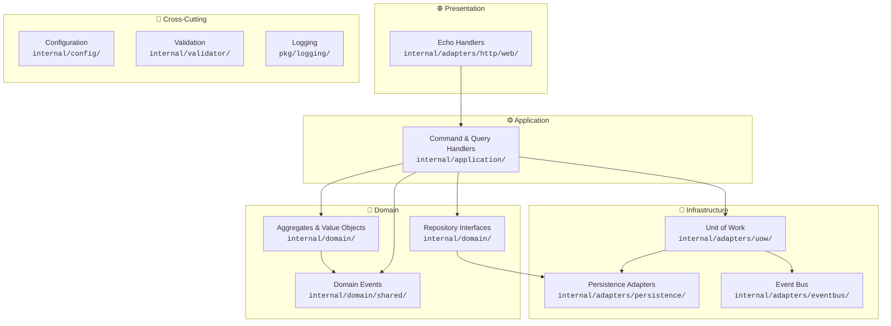
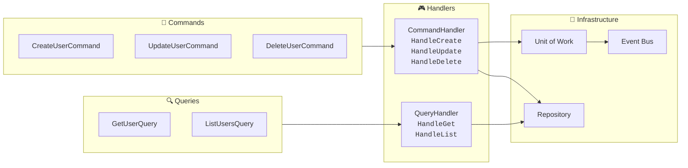
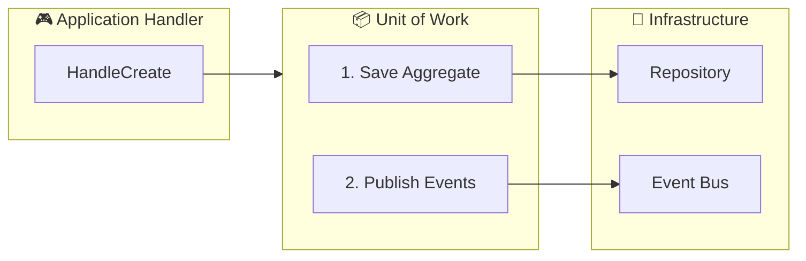

# Navigating the generated application

<p align="center">
  After <code>crank init</code>, you have a fully wired Go backend service.
  <br/>
  This page explains every layer — where things live, why they are there,
  how they connect, and how to extend them.
</p>

<p align="center">
  
  
  
  
  
</p>

---

## 📋 Table of Contents

- [Architecture overview](#architecture-overview)
- [Directory layout](#directory-layout)
- [Composition root](#composition-root)
- [Domain layer](#domain-layer)
- [Application layer](#application-layer)
- [HTTP adapter](#http-adapter)
- [Persistence adapters](#persistence-adapters)
- [Unit of Work and Event Bus](#unit-of-work-and-event-bus)
- [Cross-cutting packages](#cross-cutting-packages)
- [Request lifecycle](#request-lifecycle)
- [Feature modules](#feature-modules)
- [Code generation](#code-generation)
- [Testing patterns](#testing-patterns)
- [Configuration deep dive](#configuration-deep-dive)
- [External documentation](#external-documentation)

---

## 🏗️ Architecture overview

The generated project follows a **Domain-Driven Design** layered architecture.
Every layer depends only on the layer below it — never upward.



### 🔑 Key principles

| Principle | How it's enforced |
|-----------|------------------|
| 🧹 **Domain is pure Go** | Zero framework imports in `internal/domain/` — no HTTP, no database drivers, no serialization tags |
| ⬇️ **Dependencies point inward** | Adapters implement interfaces defined by the domain; the domain never imports adapters |
| 🎯 **Application coordinates** | Handlers load aggregates, call domain methods, and route persistence + events through ports |
| 🔌 **Composition root** | `cmd/server/main.go` is the only place concrete types meet interfaces |

### 📐 Dependency rule

```
HTTP Handlers  →  Application Handlers  →  Domain (Aggregates + Ports)  ←  Infrastructure Adapters
     │                    │                                                    │
     └─── DTOs live ──────┘                                                    │
          here                                                                 │
                                                                               │
          Infrastructure adapters (Persistence, EventBus, etc.) implement      │
          interfaces defined in the Domain — the domain never                  │
          imports infrastructure.                                              │
```

---

## 📁 Directory layout

```
myapp/
├── 📂 cmd/server/                  ←  Entry point + composition root
├── 📂 configs/                     ←  Config defaults (committed)
├── 📂 internal/
│   ├── 📂 adapters/                ←  Infrastructure implementations
│   │   ├── 📂 eventbus/            ←  In-process event bus
│   │   ├── 📂 http/web/            ←  Echo handlers + middleware
│   │   ├── 📂 persistence/         ←  memory/, bun/, gorm/ repositories
│   │   ├── 📂 cache/               ←  Redis client (redis feature)
│   │   └── 📂 uow/                 ←  Unit of Work implementations
│   ├── 📂 application/             ←  CQRS use cases
│   │   └── 📂 user/
│   ├── 📂 config/                  ←  Viper + env config loading
│   ├── 📂 domain/                  ←  Pure domain model
│   │   ├── 📂 shared/              ←  DomainEvent interface + codecs
│   │   └── 📂 user/                ←  Aggregate, ID, events, errors, port
│   ├── 📂 model/                   ←  Shared DTOs (APIError)
│   ├── 📂 ports/                   ←  Cross-cutting interfaces
│   └── 📂 validator/               ←  Request validation
├── 📂 pkg/logging/                 ←  slog helpers + redaction
├── 📂 docs/                        ←  Generated Swagger spec
├── 📂 migrations/                  ←  SQL migrations (with ORM)
├── 📄 .crank.yaml                  ←  Project manifest (do not delete)
├── 📄 .env.example                 ←  Local env template
├── 📄 .air.toml                    ←  Live-reload config
├── 📄 Dockerfile
└── 📄 Makefile                     ←  Project-specific targets
```

> 💡 **Tip:** The `internal/` directory enforces Go's visibility rules —
> nothing outside the module can import packages under `internal/`.

---

## 🚀 Composition root

This is the **single entry point** (`cmd/server/main.go`) and the only place where concrete types
are wired together. It performs these steps **in order**:

```mermaid
flowchart LR
    A["1. Load Config<br/><code>config.Load()</code>"] --> B["2. Init Logger<br/><code>slog</code>"]
    B --> C["3. Connect Infra<br/><code>DB / Redis / etc.</code>"]
    C --> D["4. Wire Domain<br/><code>Bus / Repo / UoW</code>"]
    D --> E["5. Create App Services<br/><code>Cmd + Qry Handlers</code>"]
    E --> F["6. Create HTTP Handlers<br/><code>Echo handlers</code>"]
    F --> G["7. Mount Routes<br/><code>web.Mount()</code>"]
    G --> H["8. Start Server<br/><code>e.Start(addr)</code>"]
    H --> I["SIGINT/SIGTERM<br/><code>Graceful shutdown</code>"]
```



This is also where feature clients (Redis, Temporal, MongoDB, etc.) are wired.
The generated code uses marker comments (`// crank:config-*`, `// crank:http-*`)
so that `crank add` and `crank make handler` can inject new wiring without
breaking existing code.

### 🧩 What gets wired (feature-dependent)

| Client | Initialized when |
|--------|-----------------|
| `eventbus.NewInMemory()` | Always |
| `memory.NewUserRepository()` | No ORM feature |
| `bun.NewUserRepository(db)` | `bun` feature |
| `gorm.NewUserRepository(gormDB)` | `gorm` feature |
| `redisclient.NewClient(cfg.Redis)` | `redis` feature |
| `mongodb.NewClient(ctx, cfg.MongoDB)` | `mongodb` feature |
| `qdrantclient.NewClient(ctx, cfg.Qdrant)` | `qdrant` feature |
| `temporal.NewClient(cfg.Temporal, logger)` | `temporal` feature |
| `telemetry.NewProvider(ctx, cfg.Telemetry)` | `otel` feature |
| Outbox UoW + Worker | `outbox` feature |

---

## 🧠 Domain layer

The domain layer (`internal/domain/`) is the **heart of the application** — pure Go with zero
external dependencies. Each business concept lives in its own package.

### 📦 Package anatomy

Taking the generated `internal/domain/user/` package:

| File | 🎯 Purpose |
|------|-----------|
| `user.go` | Aggregate root struct + constructor + behavior methods + event recording |
| `user_id.go` | Typed value object — prevents passing the wrong ID type at compile time |
| `events.go` | Domain events: `UserCreated`, `UserUpdated`, `UserDeleted` |
| `errors.go` | Sentinel errors: `ErrUserNotFound`, `ErrInvalidUser` |
| `repository.go` | Port (interface) — implementations live in adapters |

### 🧬 The aggregate

```go
type User struct {
    id        UserID
    name      string
    email     string
    password  string       // bcrypt hash (only with auth feature)
    createdAt time.Time
    updatedAt time.Time
    events    []shared.DomainEvent
}
```

### ✨ Design decisions

| Decision | Rationale |
|----------|-----------|
| 🔒 **Unexported fields** | The aggregate controls its own state through methods. No one can set `user.name` directly. |
| 🏷️ **No struct tags** | No `json`, `db`, `validate`, `gorm`, or `bun` tags. Each layer defines its own DTOs. |
| ❌ **Methods return errors** | Constructors and mutators validate invariants (empty name → `ErrInvalidUser`). |
| 📡 **Event sourcing ready** | Behavior methods record events via `recordEvent`. Call `PullEvents()` to collect and dispatch. |

### 🔨 Creating a new aggregate

```go
id, _ := user.NewUserID("usr_123")
u, err := user.NewUser(id, "Alice", "alice@example.com")
// u.PullEvents() → [UserCreated{...}]
```

### 🔄 Shared domain event infrastructure

The `internal/domain/shared/` package provides:

| Component | Purpose |
|-----------|---------|
| `DomainEvent` interface | `EventName() string`, `OccurredAt() time.Time` |
| `EncodeEvent()` / `DecodeEvent()` | JSON serialize/deserialize for transport |
| `EventEnvelope` | Wire format: name + timestamp + JSON body |
| Event factory registry | Maps event names to constructors for reliable deserialization |

---

## ⚙️ Application layer

The application layer (`internal/application/`) implements use cases using the **CQRS pattern** —
Commands mutate state, Queries read state. They never mix.

### 📦 Package anatomy



### 🎮 Command handler pattern

```go
func (h *CommandHandler) HandleCreate(ctx context.Context, cmd CreateUserCommand) (*user.User, error) {
    id, err := user.NewUserID(cmd.ID)
    u, err := user.NewUser(id, cmd.Name, cmd.Email)
    err := h.uow.SaveAndPublish(ctx,
        func(ctx context.Context) error { return h.repo.Save(ctx, u) },
        u.PullEvents(),
    )
    return u, nil
}
```

> ⚡ The command handler **never** calls `repo.Save` directly — it goes through
> the **Unit of Work** to ensure the aggregate save and event publication
> are handled atomically.

### ❓ Why CQRS?

| Benefit | Explanation |
|---------|-------------|
| 🚀 **Optimize reads independently** | Swap in a read-optimized store (cached view, materialized table) without touching command logic |
| 🎯 **Handlers stay focused** | Command handlers handle mutations + events; query handlers do pure reads |
| 🧩 **Clear intent** | A `POST` handler calls `cmd.HandleCreate`, a `GET` handler calls `qry.HandleGet` |

---

## 🌐 HTTP adapter

The presentation layer (`internal/adapters/http/web/`) — translates HTTP requests to application commands/queries
and results back to JSON.

### 📦 Files at a glance

| File | 🎯 Role |
|------|---------|
| `server.go` | Creates Echo instance, wires the smart binder, exposes `GET /health` |
| `routes.go` | Central route aggregator — generated handlers splice in via marker comments |
| `user_handler.go` | CRUD handler — DTOs, Swagger annotations, error mapping |
| `middleware/logging.go` | Request-scoped logger injection |
| `middleware/auth.go` | JWT middleware (with auth feature) |

### 🧠 The smart binder

The generated server replaces Echo's default binder with a custom `echoBinder`
that **automatically validates** after every `c.Bind()`:

```go
type echoBinder struct {
    defaultBinder echo.Binder
    logger        *slog.Logger
}

func (b *echoBinder) Bind(i any, c echo.Context) error {
    if err := b.defaultBinder.Bind(i, c); err != nil {
        return echo.NewHTTPError(http.StatusBadRequest, err.Error())
    }
    if err := validator.Struct(i); err != nil {
        return err  // automatically formatted as ValidationError
    }
    return nil
}
```

This means handlers **never** call the validator explicitly:

```go
func (h *UserHandler) Create(c echo.Context) error {
    var in userDTO
    if err := c.Bind(&in); err != nil {  // Bind + validate in one call
        return err
    }
    // ✅ `in` is guaranteed valid past this point
    out, err := h.cmd.HandleCreate(c.Request().Context(), in.toCreateCommand())
    // ...
}
```

### 📨 DTO pattern

HTTP handlers define their own DTOs with JSON and validation tags —
they are **not** the domain aggregate:

```go
type userDTO struct {
    ID    string `json:"id"    validate:"required"`
    Name  string `json:"name"  validate:"required,min=2,max=100"`
    Email string `json:"email" validate:"required,email"`
}

func (d userDTO) toCreateCommand() appuser.CreateUserCommand {
    return appuser.CreateUserCommand{ID: d.ID, Name: d.Name, Email: d.Email}
}
```

### 🔌 Route wiring

`routes.go` uses **marker comments** to make code generation idempotent:

```go
type MountConfig struct {
    UserHandler *UserHandler
    // crank:http-fields ← new handlers splice fields here
}

func Mount(e *echo.Echo, cfg MountConfig) {
    g := e.Group("/users")
    cfg.UserHandler.Register(g)
    // crank:http-register ← new handlers splice registrations here
}
```

### 🚨 Error handling

The composition root installs a custom `HTTPErrorHandler` that:

1. 🟡 **ValidationError** → 422 with field-level error details
2. 🔴 **echo.HTTPError** → Appropriate HTTP status code
3. ⚫ **Unhandled errors** → 500 Internal Server Error

Handlers map domain errors to HTTP status codes:

```go
if errors.Is(err, user.ErrUserNotFound) {
    return c.JSON(http.StatusNotFound, model.APIError{Error: "user not found"})
}
```

---

## 🔌 Persistence adapters

These (`internal/adapters/persistence/`) implement the domain's `Repository` interface. The composition root
decides which one to wire in — **no application code changes**.

### 🗃️ Available adapters

| Adapter | Location | 🎯 Use Case |
|---------|----------|-------------|
| 🧠 **In-memory** | `persistence/memory/` | Unit tests, local dev without database |
| 🐘 **GORM** | `persistence/gorm/` | Production PostgreSQL (with `gorm` feature) |
| 🐘 **Bun** | `persistence/bun/` | Production PostgreSQL (with `bun` feature) |

The in-memory repository is a thread-safe `sync.RWMutex`-guarded map —
perfect for fast tests:

```go
type UserRepository struct {
    mu    sync.RWMutex
    byID  map[string]*user.User
    byEml map[string]*user.User
}
```

### 🔄 Switching adapters

To switch from in-memory to PostgreSQL, change only the **composition root**:

```go
// In-memory (default)
userRepo := memory.NewUserRepository()

// Bun
userRepo := bun.NewUserRepository(db)

// GORM
userRepo := gorm.NewUserRepository(gormDB)
```

No application or HTTP code changes — they depend only on the domain's `Repository` interface.

---

## 🔄 Unit of Work and Event Bus

These two abstractions ensure atomicity between persisting an aggregate
and publishing its domain events.

### 📐 The core flow



### 💾 In-memory Unit of Work

The default implementation runs save then publish sequentially:

| Step | Action | On failure |
|------|--------|------------|
| 1 | `repo.Save(ctx, user)` | ❌ Short-circuit — events not published |
| 2 | `bus.Publish(ctx, events)` | ⚠️ Logged — save stands |

### 📤 Outbox Unit of Work (with `outbox` feature)

Both operations share a **database transaction**:

1. **Aggregate** saved to its table
2. **Domain events** written to `outbox_events` table in same transaction
3. **Background worker** polls outbox table and relays events to the bus
4. **Events deleted** after successful publication (at-least-once delivery)

This eliminates the window between "save succeeded" and "publish failed"
that the in-memory UoW has.

### 📡 Event Bus

The in-memory bus is a simple pub/sub:

```go
bus := eventbus.NewInMemory()
bus.Subscribe(func(ctx context.Context, ev shared.DomainEvent) error {
    slog.Default().Info("event received", "event", ev.EventName())
    return nil
})
```

Subscribers are called **synchronously** in registration order. A failing
subscriber does not block others — the error is logged and the next one runs.

---

## 🔧 Cross-cutting packages

### ⚙️ Configuration (`internal/config/`)

```
Priority:  env vars  >  .env file  >  configs/config.yaml
```

| File | Committed? | Use |
|------|-----------|-----|
| `configs/config.yaml` | ✅ Yes | Non-secret defaults (host, port, log level) |
| `.env.example` | ✅ Yes | Template for developers |
| `.env` | ❌ No | Local secrets, gitignored |

Secret fields use `env:"SECRET_NAME"` tags and are loaded from `.env`
or environment variables. Feature configs are injected via marker comments.

### ✅ Validation (`internal/validator/`)

Preconfigured `go-playground/validator` singleton:

- Uses JSON tag names in error messages
- Automatically called by the smart Echo binder
- Extensible — add custom validators in `init()`:

```go
validate.RegisterValidation("notblank", func(fl validator.FieldLevel) bool {
    return strings.TrimSpace(fl.Field().String()) != ""
})
```

### 📝 Model (`internal/model/`)

Shared response types used by every HTTP handler:

```go
type APIError struct {
    Error   string `json:"error"`
    Details any    `json:"details,omitempty"`
}
```

### 📊 Logging (`pkg/logging/`)

Helpers built on `log/slog`:

| Function | Purpose |
|----------|---------|
| `logging.New(level, addSource)` | Creates a configured logger |
| `logging.FromContext(ctx)` | Retrieves request-scoped logger |
| `logging.Redacted(key, value)` | Redacts sensitive values (passwords, tokens) |

### 🔌 Ports (`internal/ports/`)

Cross-cutting interfaces that adapters implement:

| Interface | Purpose | Default implementation |
|-----------|---------|-----------------------|
| `EventBus` | Publish domain events | In-memory bus |
| `UnitOfWork` | Atomic save + publish | In-memory UoW |
| `Hasher` | Hash/compare passwords | BCrypt (with `auth`) |
| `TokenService` | Issue/refresh/validate JWT | JWT service (with `auth`) |
| `Cache` | Get/Set/Delete cache entries | (with `redis`) |
| `Cipher` | Encrypt/Decrypt data | AES-256-GCM (with `crypto`) |
| `TracerProvider` | Create OTel tracers | Stdout exporter (with `otel`) |

---

## 📡 Request lifecycle

```
                          POST /users
                      {"name":"Alice","email":"a@b.com"}
                              │
                              ▼
┌──────────────────────────────────────────────────────┐
│                   Echo Router                        │
│  Matches POST /users → UserHandler.Create            │
└──────────────────────────────────┬───────────────────┘
                                   │
                                   ▼
┌──────────────────────────────────────────────────────┐
│              echoBinder.Bind(&userDTO)                │
│                                                       │
│   1. DefaultBinder.Bind() → parse JSON into struct    │
│   2. validator.Struct()    → validate tags            │
│                                                       │
│   ── On failure ──→ 422 ValidationError              │
└──────────────────────────────────┬───────────────────┘
                                   │
                                   ▼
┌──────────────────────────────────────────────────────┐
│               UserHandler.Create(c)                   │
│                                                       │
│   userDTO.toCreateCommand() → CreateUserCommand       │
│   cmd.HandleCreate(ctx, cmd)                          │
└──────────────────────────────────┬───────────────────┘
                                   │
                                   ▼
┌──────────────────────────────────────────────────────┐
│           Application CommandHandler                  │
│                                                       │
│   1. user.NewUserID(cmd.ID)                           │
│   2. user.NewUser(id, name, email)                    │
│       → User aggregate + UserCreated event            │
│   3. uow.SaveAndPublish(ctx, saveFn, events)          │
│       ├── repo.Save(ctx, user)                        │
│       └── bus.Publish(ctx, UserCreated{...})          │
└──────────────────────────────────┬───────────────────┘
                                   │
                                   ▼
┌──────────────────────────────────────────────────────┐
│                   Response                            │
│                                                       │
│   toUserDTO(result) → 201 Created                     │
│   { "id":"...", "name":"Alice", "email":"a@b.com" }  │
└──────────────────────────────────────────────────────┘
```

---

## 🧩 Feature modules

Each optional feature adds files to the project. Here is what every feature
contributes and where to find it.

<details>
<summary><strong>🔐 Auth</strong> — JWT authentication + bcrypt</summary>

| File | Purpose |
|------|---------|
| `internal/ports/hasher.go` | Password hashing interface |
| `internal/ports/tokenservice.go` | Token issue/refresh/validation interface |
| `internal/adapters/crypto/bcrypt_hasher.go` | BCrypt hashing |
| `internal/adapters/crypto/jwt_token_service.go` | JWT token management |
| `internal/adapters/http/web/auth_handler.go` | `/auth/register`, `/auth/login`, `/auth/refresh`, `/me` |
| `internal/adapters/http/web/middleware/auth.go` | `JWTAuth()` middleware |
| `internal/domain/user/email.go` | Email value object |
| `internal/domain/user/password.go` | Password value object |

**Endpoints:**

| Method | Path | Auth | Description |
|--------|------|------|-------------|
| POST | `/auth/register` | ❌ | Create account + return tokens |
| POST | `/auth/login` | ❌ | Authenticate + return tokens |
| POST | `/auth/refresh` | ❌ | Exchange refresh token for new pair |
| GET | `/me` | ✅ Bearer | Current user ID from JWT |

**Protecting custom routes:**
```go
e.GET("/admin", adminHandler, middleware.JWTAuth(tokens))
```
</details>

<details>
<summary><strong>🗄️ Bun ORM</strong> — PostgreSQL via Bun</summary>

| File | Purpose |
|------|---------|
| `internal/adapters/persistence/bun/db.go` | PostgreSQL connection with `pgdriver` |
| `internal/adapters/persistence/bun/migrate.go` | Migration runner |
| `internal/adapters/persistence/bun/user_repository.go` | Bun-backed user repository |
| `migrations/000001_init.up.sql` | Initial schema |
| `migrations/000001_init.down.sql` | Schema rollback |

📖 [bun.uptrace.dev](https://bun.uptrace.dev)
</details>

<details>
<summary><strong>🗄️ GORM</strong> — PostgreSQL via GORM</summary>

| File | Purpose |
|------|---------|
| `internal/adapters/persistence/gorm/db.go` | PostgreSQL connection |
| `internal/adapters/persistence/gorm/migrate.go` | Migration runner |
| `internal/adapters/persistence/gorm/user_repository.go` | GORM-backed user repository |
| `migrations/000001_init.up.sql` | Initial schema |
| `migrations/000001_init.down.sql` | Schema rollback |

📖 [gorm.io/docs](https://gorm.io/docs)
</details>

<details>
<summary><strong>⚡ Redis</strong> — Caching client</summary>

| File | Purpose |
|------|---------|
| `internal/ports/cache.go` | Cache interface |
| `internal/adapters/cache/redis/client.go` | `redis.Client` connection |

Wired in the composition root as `rdb`. 📖 [redis.uptrace.dev](https://redis.uptrace.dev)
</details>

<details>
<summary><strong>🍃 MongoDB</strong> — Document database client</summary>

| File | Purpose |
|------|---------|
| `internal/adapters/persistence/mongodb/client.go` | `mongo.Client` connection |

Wired as `mdb`. Access via `mdb.Client().Database("name").Collection("coll")`.
📖 [mongodb.com/docs/drivers/go](https://www.mongodb.com/docs/drivers/go/)
</details>

<details>
<summary><strong>🧠 Qdrant</strong> — Vector database client</summary>

| File | Purpose |
|------|---------|
| `internal/adapters/persistence/qdrant/client.go` | Qdrant gRPC client |

📖 [qdrant.tech/documentation](https://qdrant.tech/documentation/)
</details>

<details>
<summary><strong>⏰ Temporal</strong> — Workflow orchestration</summary>

| File | Purpose |
|------|---------|
| `internal/adapters/temporal/client.go` | Temporal client + slog bridge |
| `internal/adapters/temporal/worker.go` | Worker with marker-based registration |
| `internal/adapters/temporal/workflow/greeting.go` | Example workflow |
| `internal/adapters/temporal/activity/greeting.go` | Example activity |
| `cmd/worker/main.go` | Standalone worker entry |

Generate new workflows:
```bash
crank make workflow OrderFulfillment order_id:uuid
crank make activity ChargeCard amount:float --tests
```
📖 [docs.temporal.io/dev-guide/go](https://docs.temporal.io/dev-guide/go)
</details>

<details>
<summary><strong>📊 OpenTelemetry</strong> — Distributed tracing</summary>

| File | Purpose |
|------|---------|
| `internal/ports/tracer.go` | TracerProvider interface |
| `internal/adapters/telemetry/otel.go` | OTel SDK setup (stdout exporter) |
| `internal/adapters/http/web/middleware/tracing.go` | HTTP tracing middleware |

Emits spans to stdout by default. Swap to OTLP for production.
📖 [opentelemetry.io/docs/languages/go](https://opentelemetry.io/docs/languages/go/)
</details>

<details>
<summary><strong>🔒 Crypto</strong> — AES-256-GCM encryption</summary>

| File | Purpose |
|------|---------|
| `internal/ports/cipher.go` | Encrypt/Decrypt interface |
| `internal/adapters/crypto/aesgcm/cipher.go` | AES-256-GCM implementation |

Generate a strong key: `openssl rand -base64 32`
</details>

<details>
<summary><strong>🎨 Views</strong> — React SPA</summary>

| File | Purpose |
|------|---------|
| `internal/adapters/http/web/views.go` | SPA serving + Vite proxy |
| `static/embed.go` | Embedded static assets |
| `src/App.jsx` | React application |
| `vite.config.js` | Vite dev server config |

Toggle with `views.enabled` in config. Set `views.dev_server` for HMR.
</details>

<details>
<summary><strong>📤 Outbox</strong> — Transactional outbox pattern</summary>

| File | Purpose |
|------|---------|
| `internal/domain/outbox/event.go` | Outbox event domain type |
| `internal/domain/outbox/repository.go` | Outbox repository port |
| `internal/adapters/persistence/bun/outbox_repository.go` | Bun-backed outbox repository |
| `internal/adapters/persistence/gorm/outbox_repository.go` | GORM-backed outbox repository |
| `internal/adapters/outbox/bun_uow.go` | Bun transactional UoW |
| `internal/adapters/outbox/gorm_uow.go` | GORM transactional UoW |
| `internal/adapters/outbox/worker.go` | Background poller + publisher |
| `migrations/000002_add_outbox_events.up.sql` | Outbox table schema |

Requires `gorm` or `bun`. Replaces in-memory UoW with transaction-backed.
</details>

---

## 🏭 Code generation

### What `crank make scaffold` produces (`crank make`)

```bash
crank make scaffold Product title:string price:float --tests
```

```
┌──────────────────────────────────────────────────────────┐
│                    crank make scaffold                    │
├──────────────────────────────────────────────────────────┤
│                                                           │
│  📂 internal/domain/product/                              │
│  ├── product.go              ← Aggregate root             │
│  ├── product_id.go           ← Typed ID                   │
│  ├── events.go               ← Domain events              │
│  ├── errors.go               ← Sentinel errors            │
│  └── repository.go           ← Port                       │
│                                                           │
│  📂 internal/application/product/                         │
│  ├── commands.go             ← Create/Update/Delete       │
│  ├── command_handler.go      ← Command execution           │
│  ├── queries.go              ← Get/List                   │
│  └── query_handler.go        ← Query execution            │
│                                                           │
│  📂 internal/adapters/persistence/memory/                 │
│  └── product_repository.go   ← In-memory implementation   │
│                                                           │
│  📂 internal/adapters/http/web/                           │
│  └── product_handler.go      ← Echo handler + DTOs        │
│                                                           │
│  In routes.go:               ← Route wiring (idempotent)  │
│  In migrations/:             ← SQL migration (bun only)   │
│  _test.go files:             ← With --tests flag          │
│                                                           │
└──────────────────────────────────────────────────────────┘
```

### 📋 What each kind generates

| Kind | 🎯 Primary artifact | 🔄 Dependencies generated |
|------|--------------------|--------------------------|
| `model` | Domain aggregate, ID, events, errors, port | — |
| `repository` | Repository implementation | Domain model (if missing) |
| `service` | Commands, queries, handlers | Domain + repository (if missing) |
| `handler` | HTTP handler + route wiring | Domain + service + repo (skipped with `--only`) |
| `scaffold` | Everything above | Everything above |
| `workflow` | Temporal workflow + registration | — |
| `activity` | Temporal activity + registration | — |
| `migration` | SQL up/down pair | — |

> ⚠️ **Idempotency:** Running `crank make scaffold Product` twice errors on
> the primary artifact but **skips** existing dependency files. Use `--force`
> to overwrite. Route wiring is idempotent — no duplicate registrations.

---

## 🧪 Testing patterns

The in-memory adapters make it possible to test **every layer** without a database.

### 🧪 Testing the domain

No mocks needed — pure Go types:

```go
func TestNewUser(t *testing.T) {
    id, _ := user.NewUserID("test-1")
    u, err := user.NewUser(id, "Alice", "alice@example.com")
    assert.NoError(t, err)
    assert.Equal(t, "Alice", u.Name())
    events := u.PullEvents()
    assert.Len(t, events, 1)
    assert.Equal(t, "user.created", events[0].EventName())
}
```

### 🧪 Testing application handlers

Wire in-memory adapters directly — no database required:

```go
func TestCreateUser_CommandHandler(t *testing.T) {
    repo := memory.NewUserRepository()
    bus := eventbus.NewInMemory()
    uow := uow.NewInMemoryUoW(bus)
    handler := userapp.NewCommandHandler(repo, uow)

    user, err := handler.HandleCreate(context.Background(), user.CreateUserCommand{
        ID: "test-1", Name: "Alice", Email: "alice@example.com",
    })
    assert.NoError(t, err)
    assert.Equal(t, "Alice", user.Name())
}
```

### 🧪 Testing HTTP handlers

Use Echo's `httptest` helpers:

```go
func TestUserHandler_Create(t *testing.T) {
    // Wire in-memory adapters
    repo := memory.NewUserRepository()
    bus := eventbus.NewInMemory()
    uow := uow.NewInMemoryUoW(bus)
    cmd := userapp.NewCommandHandler(repo, uow)
    qry := userapp.NewQueryHandler(repo)
    handler := web.NewUserHandler(cmd, qry)

    // Echo test
    e := echo.New()
    body := `{"name":"Alice","email":"a@b.com"}`
    req := httptest.NewRequest(http.MethodPost, "/users", strings.NewReader(body))
    req.Header.Set(echo.HeaderContentType, echo.MIMEApplicationJSON)
    rec := httptest.NewRecorder()
    c := e.NewContext(req, rec)

    err := handler.Create(c)
    assert.NoError(t, err)
    assert.Equal(t, http.StatusCreated, rec.Code)
}
```

### 📊 Test coverage strategy

| Layer | Approach | 🎯 What to test |
|-------|----------|----------------|
| 🧠 **Domain** | Pure Go unit tests | Invariants, event recording, error cases |
| ⚙️ **Application** | In-memory repo + bus | Command/query logic, event publication |
| 🌐 **HTTP** | Echo `httptest` helpers | Routing, status codes, validation, response shapes |
| 🔌 **Persistence** | Real DB or in-memory | Save/get/delete round-trips |

---

## ⚙️ Configuration deep dive

### 📥 How config loads

```
┌──────────────────────────────────────────────────┐
│              godotenv.Load()                      │
│  Reads .env into process environment              │
│  (silently skipped if .env doesn't exist)         │
└──────────────────────┬───────────────────────────┘
                       │
┌──────────────────────▼───────────────────────────┐
│              viper.ReadInConfig()                 │
│  Reads configs/config.yaml                        │
│  Sets defaults via setDefaults()                  │
└──────────────────────┬───────────────────────────┘
                       │
┌──────────────────────▼───────────────────────────┐
│           env.ParseWithOptions(&cfg)              │
│  Overlays env vars on fields tagged env:"..."     │
│  (typically secrets only)                        │
└──────────────────────┬───────────────────────────┘
                       │
                       ▼
                  ✅ Final Config
```

### ➕ Adding a new config field

1. Add the field to `Config` struct in `internal/config/config.go`
2. Add a Viper default in `setDefaults()`
3. Add the YAML key to `configs/config.yaml`
4. If it's a secret, add `env:"VAR_NAME"` tag and document in `.env.example`

### 🔧 Feature config injection

When you run `crank add redis`, new config fields are injected at marker comments:

```go
type Config struct {
    App AppConfig `mapstructure:"app"`
    // crank:config-fields       ← RedisConfig inserted here
    Logging LoggingConfig `mapstructure:"logging"`
}
```

The injection is **idempotent** — adding the same feature twice is a no-op.

---

## 📚 External documentation

| Framework | Official docs |
|-----------|---------------|
| [](https://echo.labstack.com) | [echo.labstack.com](https://echo.labstack.com) |
| [](https://github.com/spf13/viper) | [github.com/spf13/viper](https://github.com/spf13/viper) |
| [](https://pkg.go.dev/github.com/go-playground/validator/v10) | [pkg.go.dev](https://pkg.go.dev/github.com/go-playground/validator/v10) |
| [](https://pkg.go.dev/log/slog) | [pkg.go.dev/log/slog](https://pkg.go.dev/log/slog) |
| [](https://github.com/swaggo/swag) | [github.com/swaggo/swag](https://github.com/swaggo/swag) |
| [](https://github.com/golang-migrate/migrate) | [github.com/golang-migrate/migrate](https://github.com/golang-migrate/migrate) |
| [](https://gorm.io/docs) | [gorm.io/docs](https://gorm.io/docs) |
| [](https://bun.uptrace.dev) | [bun.uptrace.dev](https://bun.uptrace.dev) |
| [](https://redis.uptrace.dev) | [redis.uptrace.dev](https://redis.uptrace.dev) |
| [](https://www.mongodb.com/docs/drivers/go/) | [mongodb.com/docs/drivers/go](https://www.mongodb.com/docs/drivers/go/) |
| [](https://qdrant.tech/documentation/) | [qdrant.tech/documentation](https://qdrant.tech/documentation/) |
| [](https://docs.temporal.io/dev-guide/go) | [docs.temporal.io/dev-guide/go](https://docs.temporal.io/dev-guide/go) |
| [](https://opentelemetry.io/docs/languages/go/) | [opentelemetry.io/docs/languages/go](https://opentelemetry.io/docs/languages/go/) |
| DDD | [dddcommunity.org](https://www.dddcommunity.org/) |
| CQRS | [martinfowler.com/bliki/CQRS.html](https://martinfowler.com/bliki/CQRS.html) |

---

<p align="center">
  
  <br/>
  <strong>crank</strong> — Scaffold. Build. Ship.
</p>
